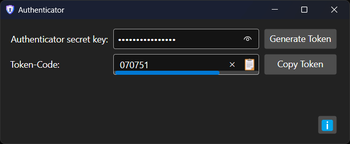

#  Authenticator

## Description
This free utility helps you use 2FA/Multi-factor authentication from your desktop without the need to pull out your phone each time you authenticate.

## Documentation

- [User's Guide](/docs/UserGuide.md)
- [Developer's Guide](/docs/DevelopersGuide.md)

## Contributors
Developed by A.Lazaro.

### Other 2FA/MFA applications
- [Microsoft Authenticator alternatives](https://alternativeto.net/software/microsoft-authenticator/)
- [Authenticator browser extension](https://authenticator.cc/)
- [Authy](https://authy.com/)
- [2fast](https://apps.microsoft.com/store/detail/2fast-%E2%80%93-two-factor-authenticator/9P9D81GLH89Q) ([source](https://github.com/2fast-team/2fast/))
- [Protecc](https://apps.microsoft.com/store/detail/protecc-2fa-authenticator-totp/9PJX91M06TZS) ([source](https://github.com/FireCubeStudios/Protecc))
- [TOTP Token Generator](https://totp.danhersam.com/) (Online web version)

